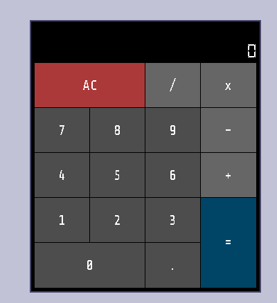
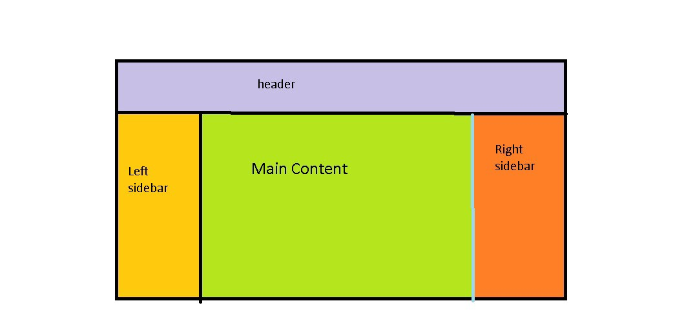
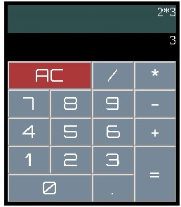

## How to use a little CSS Grid magic to design a calculator app

This article is copied from an article found [on medium](#reference).

This article is a quick intro to CSS Grid. We will be making a calculator using it.

This article is good for developers who have a basic understanding of CSS and for those who want to learn the newer tools CSS offers to style pages.

I liked CSS Grid area templates from the very start! The examples all over the web can look complicated, but trust me, one attempt at using them and you will love them and use them in many of your projects.

This thought started after wanting to make something similar to the image below.



Note that the =, 0, and AC buttons are twice in size of regular buttons. At first I thought of using the table HTML element and colspan and rowspan to make this. But then I wondered if we could make it using CSS Flexbox. After failing to place the = and 0 and . in the same row, I began to realize the need for CSS Grid.

The complete code for this is available here: [CSS-Grid-Calculator](https://github.com/deepikagunda/CSS-Grid-Calculator).

### What is CSS Grid?
The CSS Grid Layout Module offers a grid-based layout system, with rows and columns, making it easier to design web pages without having to use floats and positioning. — from my fav w3schools.com

So I would assume the main layout and table-like content look like grids, so we can use CSS Grid to style them.

## First thing to make a grid

We have to use the display:grid on any container which needs to be a grid. In case it is the whole main page of website, we can do it like this:

```html
<html>
<style>
 #main{
       display:grid;
     }
</style>
<body>
<div id="main">
</div>
</body>
</html>
```

## What’s next?

Let’s say you want to make a website which has a navbar, right sidebar, left sidebar, and middle portion for content. Typically you would want the navbar and sidebars to have fixed width and height in terms of viewport percentages and the content portion to expand in whatever space is left.

So how do we do that?



```html
<style>
#main{
 display:grid;
 grid-template-columns: 20vw auto 20vw;
 grid-template-rows: 15vh auto;
 grid-template-areas:"header header header"
                     "leftSB content rightSB";
}
#header{
 grid-area:header;
}
#leftSB{
  grid-area:leftSB;
}
#rightSB{
  grid-area:rightSB;
}
#content{
grid-area:content;
}
</style>
<body>
 <div id="main">
   <div id="header>header</div>
   <div id="rightSB">right sidebar</div>
   <div id="leftSB">left sidebar</div>
   <div id="content">content</div>
 </div>
</body>
```

Here is what achieves the layout we needed.

## Detailed explanation
In the picture above, you can see that we just needed to create simple divs which hold our header, sidebars, and content and add it to the root.

In the style section, we have added “display:grid” for the main container.

Next, we can see that overall we need 2 rows and 3 columns. That is why we have added the line
```
grid-template-columns: 20vw auto 20vw;
```
We are telling it that we need 3 columns, and that the first column should occupy 20% of the view’s width, that the next column is auto (that is all the space available to be taken by this column), and that the last column is again 20% of view’s width.
```
grid-template-rows: 15vh auto;
```
We are here saying that we need two rows overall. The first row will be used for a header and it will be 15% of viewport height, and the remaining space is needed for the second row.

Now comes grid-template-areas. Here we define in simple names what will occupy the grid. Let’s say we want the header to take the whole first row and there should be no divisions. Then we use the following:
```
grid-template-areas:"header header header"
```
Because we have 3 columns, we need to mention header 3 times. By using the same name, the outcome will be a unified header region.
```
grid-template-areas:"header header header"
                     "leftSB content rightSB";
```
This is the complete grid-template-areas, which uses simple names to define each portion of our 2 * 3 grid.

Now that we have defined the grid template, we are going to assign the divs to these areas. So, we have used the IDs of the div and assigned the template area name using grid-area.

```
#header{
 grid-area:header;
}
#leftSB{
  grid-area:leftSB;
}
```

Thats it, we have now defined how these divs should be positioned on all viewport sizes without using floats or widths on individual items and also without using bootstrap etc.

Isn’t it mind-blowing? See what we created in these few lines in action [here](https://codepen.io/deepikag/pen/xmLLoE).

## What’s next?
We can now work on our divs to add sidebars, navbars etc. I will leave this example here and now proceed to see a little complicated calculator design using CSS Grid.

## Defining the components
We have a formula display section, the current display section at the top. The rest are the buttons 0–9, the AC (clear) button, and the operator buttons + — * / and =.

So, let’s create buttons and divs for all the components and keep them in a container.

```html
<body>
 <div id="root">
  <label id="display"> 0</label>
  <label id="cdisplay" >0</label>
  <button id="clear">AC </button>
  <button id="divide">/</button>
  <button id="multiply">*</button>
  <button id="seven">7</button>
  <button id="eight">8</button>
  <button id="nine">9</button>
  <button id="minus">-</button>
  <button id="four">4</button>
  <button id="five">5</button>
  <button id="six">6</button>
  <button id="plus">+</button>
  <button id="one">1</button>
  <button id="two">2</button>
  <button id="three">3</button>
  <button id="zero">0</button>
  <button id="dot">.</button>
  <button id="equal">=</button>
  
 </div>
 </body>
```



Let’s look at the calculator image. You can see that we have 4 columns and 7 rows. So let’s define our grid:

```css
#root{
 padding:5px;
 background-color:black;
 width:240px;
 height:280px;
   display:grid;
   grid-template-columns: 1fr 1fr 1fr 1fr;
   grid-template-rows: 1fr 1fr 1fr 1fr 1fr 1fr 1fr;
   grid-gap:0.1px;
   grid-template-areas: 
   "display display display display"
   "cdisplay cdisplay cdisplay cdisplay"
   "clear clear divide multiply"
   "seven eight nine minus"
   "four five six plus"
   "one two three equal"
   "zero zero dot equal";
 }
```

Breaking this down…

```
display:grid;
   grid-template-columns: 1fr 1fr 1fr 1fr;
   grid-template-rows: 1fr 1fr 1fr 1fr 1fr 1fr 1fr;
```

Here we have said that we have 4 columns and 7 rows and each part of the grid is the same size. Note that the template columns and rows use 1fr. Fr is a fractional unit and **1fr** is for 1 part of the available space.

I have given the root div a width of 240 px and height of 280 px. So 1 fr is approximately 60px wide * 40 px high.

```
grid-template-areas: 
   "display display display display"
   "cdisplay cdisplay cdisplay cdisplay"
   "clear clear divide multiply"
   "seven eight nine minus"
   "four five six plus"
   "one two three equal"
   "zero zero dot equal";
 }
```

Here we have defined the grid template areas.

Grid template areas are a set of row * column strings. You need to add as many strings as there are rows in your grid. In each row-string you need to mention what each column will contain. The number of items in each string should match the count of columns.

Note how the display occupies the whole first row. So, it is added 4 times in first row-string.

cdisplay, that is current display, occupies the second row and is defined similar to display.

Next come the buttons. The clear button is in 3rd row and first and second column put together. Hence it is mentioned twice on row-string 3.

And it goes on…

Now that the major work is over, we need to assign these grid areas to the divs.

```
#display{
   grid-area:display;
 }
#cdisplay{
   grid-area:cdisplay;
 }
#clear
 {
   grid-area:clear;
 }
#divide
 {
   grid-area:divide;
 }
 #multiply
 {
   grid-area:multiply;
 }
```

I have shown how the grid areas are being assigned for 4 div’s.

The complete example can be found here where we have added a little more styling.

## Wrapping up
As mentioned earlier, this is just an introduction to CSS Grid and more specifically to CSS Grid template areas. I hope this example will make you think of CSS Grid when you look at websites from now on and I hope you will use them in the future.

If you liked my article, please clap. It is quite encouraging for me.

If you were to do the same task, how would you approach this? Let me know in the comments.

### Reference
Reference: [How to use a little CSS Grid magic to design a calculator app](https://medium.freecodecamp.org/how-to-use-a-little-css-grid-magic-to-design-a-calculator-app-e162afb2fdb4)
